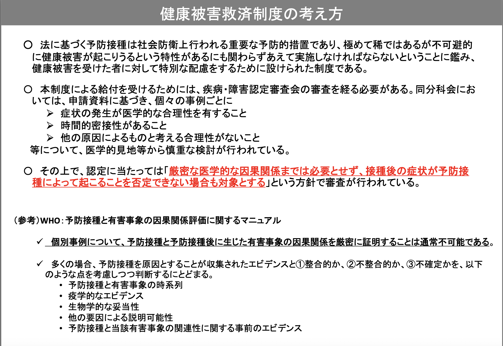
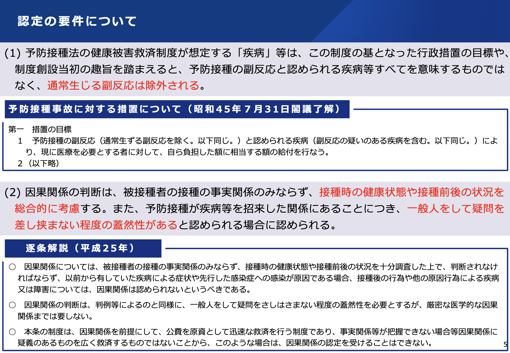

# 「厳密な因果関係」とは何か？ その言葉が生む誤解

(この記事はChatGPTの助けを借りて構成しました)

コロナウイルスに対するmRNAワクチンで、大量の健康被害が出ていることが懸念されています。2025年4月18日現在、予防接種健康被害救済制度における認定件数は9,081件、そのうち死亡例は1,004件に上ります。

この制度に関する議論の中で、よく使われる言い回しがあります。

> 「厳密な医学的な因果関係までは必要としない」

この「厳密な医学的な因果関係」という言葉が、多くの誤解を生む原因にもなっているのではないでしょうか。特に、「因果関係が厳密には証明されていないのに救済されている」といった印象が、制度の正当性そのものに対する不信感を生みやすくなっているように感じます。

この背景には、「因果関係」という言葉に、実は複数の意味が重ねられて使われているという構造があります。

---

(2025/12/23追記)

まず、事実関係として、厚労省が公開しているサイトや資料の文言を確認しましょう。

[予防接種健康被害救済制度について｜厚生労働省](https://www.mhlw.go.jp/stf/seisakunitsuite/bunya/vaccine_kenkouhigaikyuusai.html)

まずこのページには、冒頭に以下のことが書かれています。

> #### 健康被害救済制度とは
> 
> 予防接種の副反応による健康被害は、極めて稀ですが、不可避的に生ずるものですので、接種に係る過失の有無にかかわらず、**予防接種と健康被害との因果関係が認定された方を迅速に救済する**ものです。(強調は筆者による)

はっきりと「**因果関係が認定された方を救済する**」という旨が書かれていますね。これだけでも、よくある「因果関係が認定されて無くても救済されている」という説明は間違いであることが分かります。

続いてその下にある「[健康被害救済制度の考え方(PDF)](https://www.mhlw.go.jp/content/10900000/001017433.pdf?utm_source=chatgpt.com)」という資料を見ますと、以下の文言があります。

> 「厳密な医学的な因果関係までは必要とせず、接種後の症状が予防接種によって起こることを否定できない場合も対象とする」という方針で審査が行われている。

ここには「厳密な医学的な因果関係を必要としない」という文言に相当する文章が書かれているように見えます。ただ、その上には「**医学的見地等から慎重な検討が行われている**」とも書かれているし、その下には「**因果関係評価に関するマニュアル**」というのも書かれていて、良く読めば因果関係のあるなしの判定をしてから認定している(「厳密な医学的な因果関係」ではないだけで)ということが分かります。

もう一つ紹介ということで、以下のページに資料が上がっています。

[第145回 疾病・障害認定審査会 感染症・予防接種審査分科会 審議結果 ｜厚生労働省](https://www.mhlw.go.jp/stf/newpage_22632.html)

[新型コロナワクチンに係る健康被害救済について(PDF)](https://www.mhlw.go.jp/content/10900000/000864824.pdf)

資料の5ページに「認定の要件について」という説明があります。

> (2) 因果関係の判断は、被接種者の接種の事実関係のみならず、接種時の健康状態や接種前後の状況を総合的に考慮する。また、予防接種が疾病等を招来した関係にあることにつき、一般人をして疑問を差し挟まない程度の蓋然性があると認められる場合に認められる。

ここでも、因果関係の判断をしているということが読めば分かります。

ここまでで、「予防接種健康被害救済制度で認定されている人は接種と被害の因果関係が認められた人達である」ということは間違いないものとして分かったかと思います。それだけ分かれば十分という人には、以下の説明は必要ないかもしれません。

しかし、では「厳密な医学的な因果関係」ではないということは、判定が緩いということ？と思った人のために、上記にも出てくる「蓋然性」という概念について深堀りつつ、そうではないということを説明するのが、以下の文章になります。

(追記終わり)

---

## 「因果関係」は2種類ある

この議論において「因果関係」という言葉には、少なくとも2つのスタイルが含まれています：

### スタイル①：機序に基づく因果関係

- ある現象がどういう機序（メカニズム）で引き起こされたかを説明できるスタイル。

> たとえば「ワクチンの成分が体内で免疫反応を起こし、それが血管に影響して……」といった出来事の連鎖の流れで説明する。

これは演繹的推論（deductive reasoning）に近く、医学的には特に病態生理の説明で重視されるものです。

補足：機序（mechanism, pathophysiology）は、医学界で病気や症状の原因とその過程を記述する際に頻繁に使われる概念です。「なぜそれが起きたのか」を納得感のある形で説明するには、この機序の記述が重視されます。

---

### スタイル②：蓋然性に基づく因果関係

- 他の要因を排除したうえで、ある出来事が原因と考えるのが妥当である、というスタイル。

> たとえば「昨日まで健康だった人が、ワクチン接種直後に突然死した。特に他の原因も見つからない」といった可能性の排除の形で説明する。

これはアブダクション（abductive reasoning）や確率的因果（probabilistic causality）と呼ばれるもので、実務の現場や制度運用の中ではむしろ一般的な判断スタイルといえます。

---

## 「厳密な因果関係」はスタイル①だけ？

こうした2つのスタイルがあるにも関わらず、「厳密な因果関係が証明されていない」という言い回しでは、しばしば

- 機序の説明 ＝ 厳密
- 蓋然性の判断 ＝ 不十分

というニュアンスが含まれがちです。

ですが、本当にそうでしょうか？

---

## 人体は複雑すぎて"演繹"にも限界がある

人体は非常に複雑で、個人差も大きく、すべての反応を予測することは困難です。たとえ機序がある程度想定されていても、すべての構成要素が明確になっているとは限りません。そのため、一見"厳密"に見える演繹的説明も、実際には仮定や未知の変数を含んでいることが多いのです。

つまり、演繹的説明だけが「科学的」「厳密」と見なされるのは、少し偏った見方だといえるでしょう。

---

## 救済制度には"蓋然性"の因果判断が向いている

ここで、予防接種健康被害救済制度の話に戻りましょう。

この制度では、「厳密な機序が解明されていなくても、蓋然性が高ければ認定される」という判断が行われています。これは決して「不確かでもいい」という意味ではなく、制度の目的に適した合理的な基準が設定されているということです。

このような設計には、以下のような理由があります：

- 現実的に、説明が難しいケースがある  
　→ 機序の全容が解明されるには時間がかかる。説明の可否が人類の知識レベルに依存するのは公平性を損ねる恐れがある。

- 制度の目的は、過失の有無を問うものではなく「被害の救済」である  
　→ 司法的責任を問う制度とは異なり、あくまで生活や健康の回復支援が目的であるため、「納得可能な因果」があれば十分。

このように、制度の性格や目的に合わせて、因果関係の評価スタイルも調整されているのです。

---

## 機序による説明だけを厳密とするのは不当である

ここまでを振り返ると、救済制度の中の文言として「厳密な因果関係」という言葉は、

- 「機序の説明が可能なほどの因果関係」＝厳密
- 「蓋然性にとどまるもの」＝不十分

という、やや一方的な価値付けに基づくもののように見えます。

ですが実際には、

- 演繹的推論にも前提の仮定がある
- 蓋然性の判断にも、現場での合理性や統計的な根拠がある

という意味で、どちらのスタイルにも"厳密さ"の条件は含まれています。

したがって、「どちらのスタイルがより厳密か」を単純に比べるのではなく、「どの目的において、どのスタイルが適しているか」を考える視点が重要です。

---

## 必要な説明のスタイルは"目的"に応じて決まる

因果関係の説明スタイルにはそれぞれ強みと限界があります。重要なのは、「どちらが正しいか」ではなく、

> どの目的において、どのスタイルがふさわしいか？

という視点を持つことです。

- 医学研究なら：詳細な機序の特定が重視される
- 救済制度なら：蓋然性に基づく実務的判断が合理的
- 裁判なら：中間的基準（過失の有無など）が用いられる

このように、状況と目的によって「厳密さ」の意味合いも変わってくるのです。

---

## まとめ：「機序」と「蓋然性」—2つのスタイルを知る

最後に、本記事で扱った因果関係の2つのスタイルをあらためてまとめておきます。

| スタイル | 内容 | 典型的な場面 |
|---------|------|------------|
| **機序に基づく因果関係** | どのようなメカニズムで起きたかを説明できる因果関係（演繹的） | 医学研究、薬理作用の説明 |
| **蓋然性に基づく因果関係** | 他の可能性を排除した上で、妥当とされる因果関係（アブダクション） | 救済制度、実務判断、裁判 |

因果関係には複数のスタイルがあり、それぞれの役割があります。その背景にある目的や判断基準を理解することが、より健全な議論につながるのではないかと思います。
